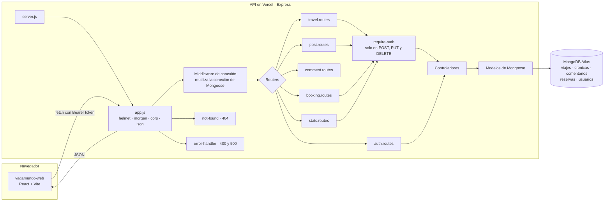
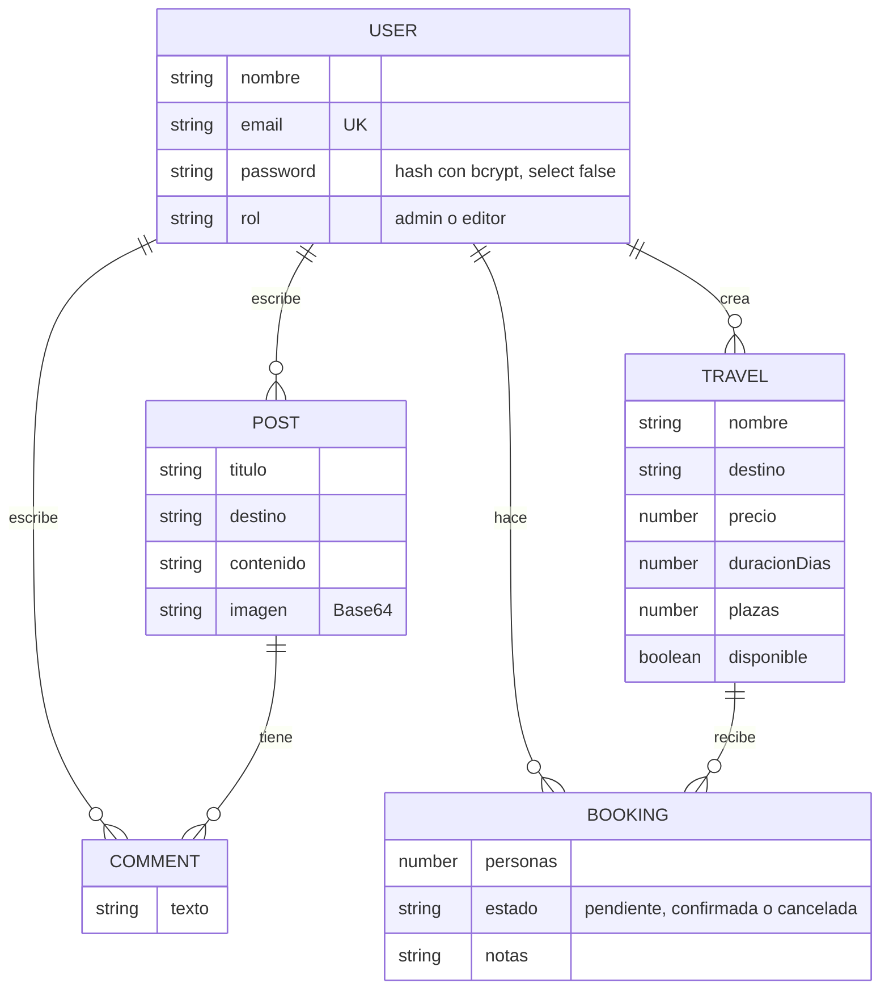

# Vagamundo · API

API REST de **Vagamundo**, la agencia de viajes en grupo pequeño que he ido
construyendo a lo largo de la asignatura. Es la mitad de servidor del proyecto
final: la otra mitad es [vagamundo-web](https://github.com/hellobymarta/vagamundo-web).

Guarda el catálogo de viajes, las crónicas del diario con sus comentarios, las
reservas de plazas y las cuentas de acceso. Leer es público; crear, corregir y
borrar exige haber iniciado sesión.

**Node · Express · Mongoose · MongoDB Atlas · JSON Web Tokens · Vercel.**

- API desplegada: https://vagamundo-api.vercel.app
- Web desplegada: https://vagamundo-web.vercel.app

## Cómo funciona por dentro



El flujo de una petición que cambia datos: el router la recibe, `require-auth`
abre el token y deja al usuario en `req.usuario`, el controlador valida y habla
con el modelo, y si algo se rompe por el camino `next(err)` lo lleva al
middleware de error, que decide si es un 400 o un 500. Ninguna ruta responde
nunca con un `console.log`.

## Las cinco colecciones



Las plazas libres de un viaje no se guardan: se calculan restando a `plazas` las
personas de sus reservas pendientes y confirmadas. Guardar un contador aparte
habría obligado a mantenerlo a mano en cada alta y cada baja, y basta con que
una falle para que el número deje de cuadrar.

## Cómo ejecutarlo

```bash
npm install
cp .env.example .env     # y dentro, la cadena de Atlas y la clave de los tokens
npm run sembrar          # crea las cuentas y los datos de ejemplo
npm run dev              # queda escuchando en el puerto 4000
```

| Variable       | Para qué                                                          |
| ---------------- | ------------------------------------------------------------------- |
| `PORT`           | El puerto en local. En Vercel no se usa                            |
| `MONGODB_URI`    | La cadena de conexión de MongoDB Atlas                             |
| `JWT_SECRET`     | Con esto se firman los tokens de sesión                            |
| `CORS_ORIGIN`    | Qué direcciones pueden llamar a la API, separadas por comas        |
| `DEBUG`          | `vagamundo:*` para ver los mensajes internos                       |

### Cuentas de ejemplo

`npm run sembrar` deja tres cuentas, todas con la contraseña `vagamundo2026`:

| Correo                 | Rol      |
| ------------------------ | ---------- |
| `marta@vagamundo.es`     | `admin`   |
| `nerea@vagamundo.es`     | `editor`  |
| `lucia@vagamundo.es`     | `editor`  |

### Probar la API

Con el servidor levantado, en otra terminal:

```bash
npm run probar
```

Recorre la API entera: entra, crea un viaje, reserva plazas, comprueba que no
deja pasarse del aforo, publica una crónica, la comenta, verifica que sin sesión
todo eso devuelve 401 y que los identificadores mal formados devuelven 400. Al
terminar borra lo que ha creado.

También están `requests.http`, para la extensión REST Client de VS Code, y
`vagamundo.postman_collection.json`, para Postman o Thunder Client. En los dos,
la petición de entrada guarda el token y el resto lo reutiliza.

### Copia de la base de datos

```bash
npm run exportar
```

Deja en `copia-bd/` un JSON por colección, para poder levantar el proyecto en
local con datos sin depender de Atlas. Las contraseñas no se incluyen, ni
siquiera cifradas.

## Los endpoints

| Ruta                          | Método    | Quién puede             |
| ------------------------------- | ----------- | ------------------------- |
| `/`                             | `GET`      | Cualquiera               |
| `/api/auth/register`            | `POST`     | Cualquiera               |
| `/api/auth/login`               | `POST`     | Cualquiera               |
| `/api/auth/me`                  | `GET`      | Con sesión               |
| `/api/travels`                  | `GET`      | Cualquiera               |
| `/api/travels/:id`              | `GET`      | Cualquiera               |
| `/api/travels`                  | `POST`     | Con sesión               |
| `/api/travels/:id`              | `PUT`      | Con sesión               |
| `/api/travels/:id`              | `DELETE`   | Quien lo creó, o un admin|
| `/api/posts`                    | `GET`      | Cualquiera               |
| `/api/posts/:id`                | `GET`      | Cualquiera               |
| `/api/posts`                    | `POST`     | Con sesión               |
| `/api/posts/:id`                | `PUT`      | Quien la escribió        |
| `/api/posts/:id`                | `DELETE`   | Quien la escribió        |
| `/api/posts/:id/comments`       | `POST`     | Con sesión               |
| `/api/comments/:id`             | `PUT`      | Quien lo escribió        |
| `/api/comments/:id`             | `DELETE`   | Quien lo escribió        |
| `/api/bookings`                 | `GET`      | Con sesión, las suyas    |
| `/api/bookings`                 | `POST`     | Con sesión               |
| `/api/bookings/:id`             | `PUT`      | Quien la hizo            |
| `/api/bookings/:id`             | `DELETE`   | Quien la hizo            |
| `/api/stats`                    | `GET`      | Con sesión               |

`GET /api/travels` acepta `?destino=`, `?categoria=` y `?maxPrecio=` para
filtrar sin traerse el catálogo entero. `GET /api/posts` acepta `?pagina=`, y va
de seis en seis porque cada crónica arrastra su fotografía.

### Códigos de respuesta

| Situación                                | Código |
| ------------------------------------------ | -------- |
| Todo bien                                 | `200`    |
| Creado                                    | `201`    |
| Falta un campo, o el id no es de Mongo    | `400`    |
| Sin sesión, o el token no vale            | `401`    |
| La cosa existe pero no es tuya            | `403`    |
| No existe                                 | `404`    |
| No caben más plazas, o el correo se repite| `409`    |
| Error del servidor                        | `500`    |

## La sesión

Al entrar, la API devuelve un token firmado con `JWT_SECRET` que caduca a los
siete días y lleva dentro solo el id. Todo lo demás se consulta en la base de
datos, que es la que manda. El navegador lo manda en la cabecera
`Authorization: Bearer …` de cada petición.

Las contraseñas se guardan cifradas con bcrypt, en un campo con `select: false`
para que no salga en las consultas salvo que se pida a propósito. Cuando alguien
se equivoca al entrar, el mensaje es el mismo tanto si el correo no existe como
si la contraseña no es la buena, para que nadie pueda averiguar qué correos
están registrados.

## Estructura

```
vagamundo-api/
├── server.js                  ← arranque en local y export para Vercel
├── vercel.json
├── requests.http              ← pruebas con REST Client
├── vagamundo.postman_collection.json
├── copia-bd/                  ← copia de las colecciones en JSON
├── scripts/
│   ├── sembrar.js             ← cuentas y datos de ejemplo
│   ├── exportar-bd.js         ← genera la copia de la base de datos
│   ├── probar.js              ← prueba la API de punta a punta
│   └── semilla/               ← fotografías de las crónicas de ejemplo
└── src/
    ├── app.js                 ← Express, middlewares y montaje de rutas
    ├── config/db.js           ← conexión con Atlas, reutilizada
    ├── middlewares/
    │   ├── require-auth.js    ← protege las rutas que cambian datos
    │   ├── not-found.js       ← 404
    │   └── error-handler.js   ← 400 y 500
    ├── models/                ← user, travel, post, comment y booking
    ├── controllers/           ← un archivo por entidad
    └── routes/                ← un router por entidad
```
