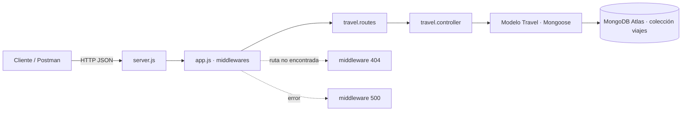

# Vagamundo API · PEC 3

API RESTful construida con **Node.js + Express + MongoDB (Mongoose)** para el catálogo de viajes
del proyecto Vagamundo (continuación de la PEC 1 y PEC 2).

## Arquitectura



## Estructura

```
PEC3/
├── server.js                          # arranque (local) y export para Vercel
├── vercel.json                        # configuración de despliegue
├── .env.example                       # variables de entorno necesarias
├── requests.http                      # pruebas de la API (REST Client)
├── vagamundo.postman_collection.json  # colección de Postman
└── src/
    ├── app.js                # configura Express y los middlewares
    ├── config/db.js          # conexión a MongoDB Atlas
    ├── models/                # User.js, Travel.js (esquemas Mongoose)
    ├── controllers/           # lógica del CRUD
    ├── routes/                # endpoints de la API
    └── middlewares/           # notFound (404) y errorHandler (500)
```


## Modelos

**User**: `nombre`, `email`, `password`, `rol` (`admin`/`user`), `createdAt`, `updatedAt`.

**Travel** (colección `viajes`): `nombre`, `descripcion`, `destino`, `precio`, `duracionDias`,
`itinerario`, `imagen`, `categoria`, `disponible`, `creadoPor` (referencia a `User`), `createdAt`,
`updatedAt`.

## Instalación y ejecución (local)

```bash
npm install
cp .env.example .env     # y rellena MONGODB_URI con tu cadena de Atlas
npm run dev              # o: npm start
```

La API quedará en `http://localhost:4000`.

## Variables de entorno

| Variable | Descripción |
|----------|-------------|
| `PORT` | Puerto local (por defecto 4000). |
| `MONGODB_URI` | Cadena de conexión de MongoDB Atlas. |

## Endpoints

| Método | Ruta | Descripción |
|--------|------|-------------|
| GET | `/` | Comprobación de estado. |
| GET | `/api/travels` | Lista todos los viajes. |
| GET | `/api/travels/:id` | Obtiene un viaje. |
| POST | `/api/travels` | Crea un viaje. |
| PUT | `/api/travels/:id` | Actualiza un viaje. |
| DELETE | `/api/travels/:id` | Elimina un viaje. |

Todas las respuestas son **JSON**. Los errores se gestionan con los middlewares **404**
(ruta no encontrada) y **500** (gestor central de errores, incluyendo errores de validación de
Mongoose devueltos como `400`).

## Pruebas

Archivos de pruebas incluidos (obligatorios):
- `requests.http` — para la extensión REST Client de VS Code.
- `vagamundo.postman_collection.json` — colección importable en Postman o Thunder Client.

## Despliegue en Vercel

1. Sube el proyecto a un repositorio de **GitHub**.
2. Importa el repositorio en **Vercel**.
3. Añade la variable de entorno `MONGODB_URI` en **Settings → Environment Variables**.
4. Despliega y comprueba que la URL pública responde y se conecta a **MongoDB Atlas**.

**URL desplegada:** https://vagamundo-api.vercel.app

## Middlewares y utilidades

- **helmet** — cabeceras HTTP de seguridad.
- **morgan** — log de cada petición por consola, en lugar de `console.log`.
- **debug** — trazas internas (conexión a Mongo, errores, arranque del servidor).
  Se activan con la variable de entorno `DEBUG`:

  ```bash
  DEBUG=vagamundo:* npm run dev
  ```

- **notFound** — middleware de 404, asignado al router de viajes y a la app.
- **errorHandler** — middleware de 500, asignado al router de viajes y a la app.
